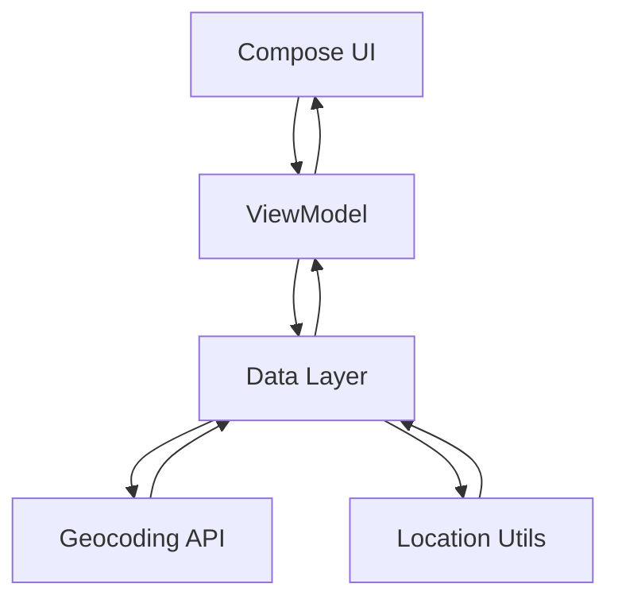

# 🛒 Shopping List App (Location-Aware)

> A modern Android app that lets users manage their shopping list with real-time location awareness and map-based selection.

---

## 📱 App Overview

This app helps users create and manage a shopping list while being aware of their current or selected location.

### 💡 Problem it solves
- Users often shop at different locations and need contextual awareness.
- This app allows:
  - 📍 Automatic location detection
  - 🗺️ Manual location selection via map
  - 🛒 Organized shopping list management

---

## ✨ Features

- 📍 Real-time location tracking (Fused Location Provider)
- 🗺️ Select location manually using Google Maps
- 🌐 Reverse geocoding (coordinates → address)
- 🛒 Add, edit, and delete shopping items
- ✏️ Inline item editing (no screen switching)
- 🔐 Smart permission handling with rationale & settings redirect
- 🎯 Clean and responsive UI (Jetpack Compose)
- ⚡ Input validation (name & quantity)
- 📜 LazyColumn for efficient list rendering

---

## 🛠 Tech Stack

### 🧑‍💻 Languages & Frameworks
- Kotlin
- Jetpack Compose

### 🏗 Architecture
- MVVM (Model-View-ViewModel)

### 📦 Libraries & Tools
- Retrofit (API calls)
- Gson Converter
- Google Maps Compose
- Fused Location Provider (Google Play Services)
- Navigation Compose

---

## 🏗 Architecture

This project follows a MVVM architecture with clear separation of concerns.
### 🔄 Data Flow



### 📌 Explanation
- UI (Compose) → Displays state
- ViewModel → Holds state & business logic
- LocationUtils → Handles GPS updates
- RetrofitClient → Handles API calls

---

## 🔄 App Flow

1. App launches → Requests location permission  
2. If granted:
   - 📍 Fetches user’s current location  
   - 🌐 Converts coordinates → address  
3. If address not available:
   - 🗺️ Opens map dialog for manual selection  
4. User:
   - Adds items ➕  
   - Edits items ✏️  
   - Deletes items 🗑️  
5. Location can be updated anytime via map icon  

---

## 📸  Demo Video

https://github.com/user-attachments/assets/43aedd34-f759-47d3-b3aa-aa6c1ca1d1fa


https://github.com/user-attachments/assets/dfb14d46-e90c-4e96-97ab-8570c4118a80


https://github.com/user-attachments/assets/31b48e96-1b5b-4963-9f2e-8d5dd6455804


https://github.com/user-attachments/assets/91ced828-9cfe-42dc-b5be-411f79f0aa33


https://github.com/user-attachments/assets/5e60a7c1-b38a-43fa-aa6e-6a8d0c668dc8

Full video link: https://youtube.com/shorts/TJjCQQDavT4

---

## 🌐 API Integration

### 🔗 API Used
- Google Geocoding API

### 📌 Purpose
- Convert latitude & longitude → human-readable address

### 🔄 How it works
@GET("maps/api/geocode/json")
suspend fun getAddressFromCoordinates(...)

### ⚠️ Error Handling
- Try-catch in ViewModel
- Safe null handling in UI
- Optional fallback using Android Geocoder

---

## 📂 Project Structure

```bash
kush.android.shoppinglistapp/
│
├── MainActivity.kt
├── Navigation.kt
│
├── location/
│   ├── LocationUtils.kt
│   ├── LocationViewModel.kt
│   ├── LocationPermissionHandler.kt
│   ├── LocationSelectionDialog.kt
│
├── api/
│   ├── GeocodingAPIService.kt
│   ├── RetrofitClient.kt
│   ├── LocationData.kt
│
├── ui/
│   ├── ShoppingList.kt
│   ├── ShoppingItemView.kt
│   ├── ShoppingItemEditor.kt
│
├── model/
│   └── ShoppingListClass.kt
```
---

## 🎯 Use Cases

- 🛒 Daily grocery management
- 📍 Tracking shopping based on location
- 🧭 Selecting store-specific shopping lists
- ✍️ Quick list editing on the go

---

## 🚧 Future Improvements

- 💾 Room Database (offline persistence)
- ☁️ Cloud sync (Firebase)
- 🔍 Search & filtering
- 📊 Category-based grouping
- 🧠 Smart suggestions based on location
- 🌙 Dark mode enhancements
- ⚙️ Dependency Injection (Hilt)

---

## 💼 Portfolio Note

This project is part of my Android development portfolio.

I am open to:
- 📱 Freelance Android development
- 💼 Internship opportunities
- 🤝 Collaboration on real-world apps

---

## ⭐ Show your support

If you like this project:
- ⭐ Star the repo
- 🍴 Fork it
- 📢 Share it

---

## 📬 Contact

Feel free to connect with me on:
- LinkedIn
- GitHub
- X (Twitter)

---
